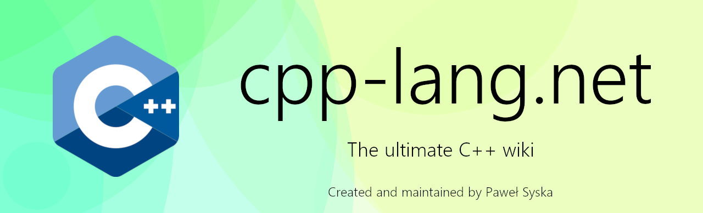
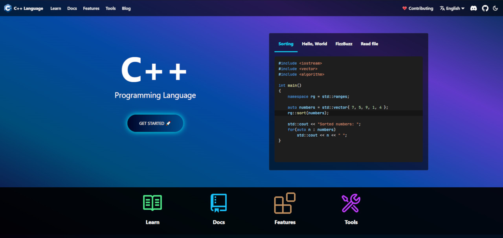

# The C++ programming language website

	

This is the official repo of [cpp-lang.net](https://cpp-lang.net) website.

It was originally created and is maintained by Paweł Syska (@PoetaKodu).

## ⚽ Goals

The main goal is to finally give C++ a proper, well designed
and open-source website with a modern learning course,
a good and readable documentation that uses modern technology.

### 🚀 [The learning course](https://cpp-lang.net/learn/)

We focus on simplicity. The teaching that people can't understand
is a bad teaching.

Examples:

- [Functions](https://cpp-lang.net/learn/course/basics/functions) (Basics)  
🌐 Translations: [Polish](https://cpp-lang.net/pl/learn/course/basics/functions)  
- [Structures](https://cpp-lang.net/learn/course/basics/structures) (Basics)  
🌐 Translations: [Polish](https://cpp-lang.net/pl/learn/course/basics/structures)  
- [Methods](https://cpp-lang.net/learn/course/basics/methods) (Basics)  
🌐 Translations: [Polish](https://cpp-lang.net/pl/learn/course/basics/methods)

### 📚 [The documentation](https://cpp-lang.net/docs/)

Documentation that contains **facts** presented in a way
that people can understand it. We want to pack the documentation
full of examples.

Examples:

- [`std::array` reference](https://cpp-lang.net/docs/std/containers/arrays/array)
- [`std::string` constructors](https://cpp-lang.net/docs/std/containers/strings/string/constructor)
- [`std::map` reference](https://cpp-lang.net/docs/std/containers/maps/map)

### 🛠 [The tool knowledge base](https://cpp-lang.net/tools/)

Picking the best programming tool should not involve days
of searching. We provide a summary of available C++ programming tools.

Examples:

- [Choosing editor](https://www.cpp-lang.net/tools/editors)
- [Choosing compiler](https://www.cpp-lang.net/tools/compilers)
- [Setup GCC on Windows](https://www.cpp-lang.net/tools/standalone/compilers/setup-gcc-windows)

### 🧱 [The features knowledge base](https://cpp-lang.net/features/)

We want programmers to know what C++ is capable of.
You'll find here the traits that define the language.
The most modern ways to code.

## 💻 Our tech

The website is powered by [Docusaurus](https://docusaurus.io).

We use React to design compontents and pages, and Markdown React (`.mdx`)
to write course lessons, articles, docs etc.

	

Docusaurus is a fantastic tool that we, as C++ programmers should leverage.

## 📖 Our methodology

We teach things using examples from the real world.
We provide graphs, images, presentations and videos that
help understand the learning material. 

## 😎 Get involved!

Do you want to help with building the best C++ website?

We appreciate any kind of help. You can try to:
- improve the course
- translate the course, docs, articles, etc.
- ... or help promote the website. Tell your friends about it 😄

Please visit the [Contributing guide](CONTRIBUTING.md).

## 💗 Contributors

Graph made with [contrib.rocks](https://contrib.rocks).
